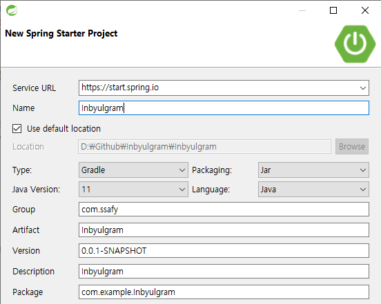
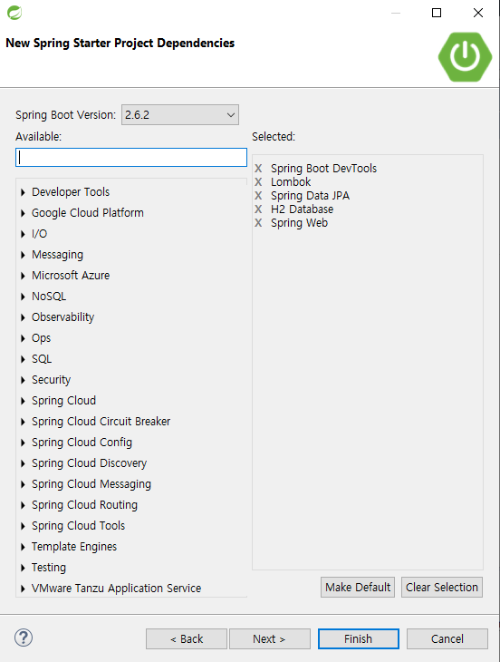
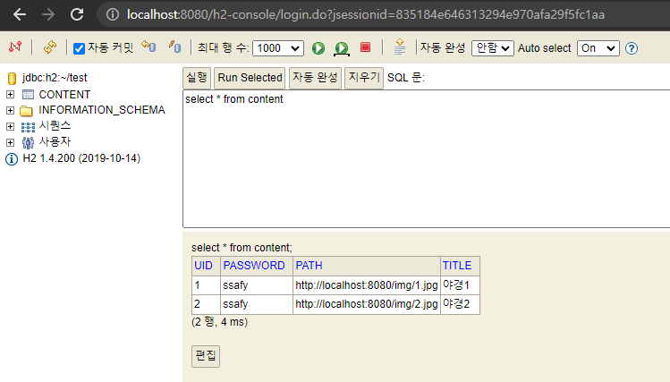
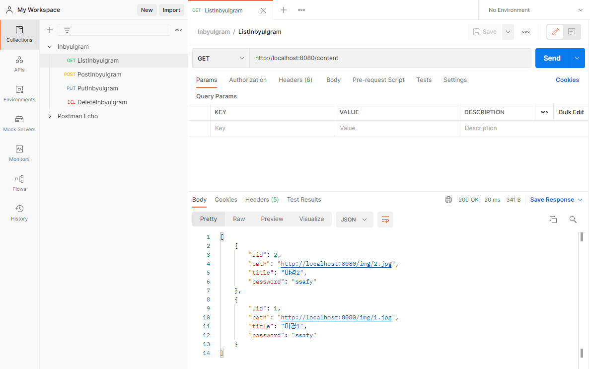
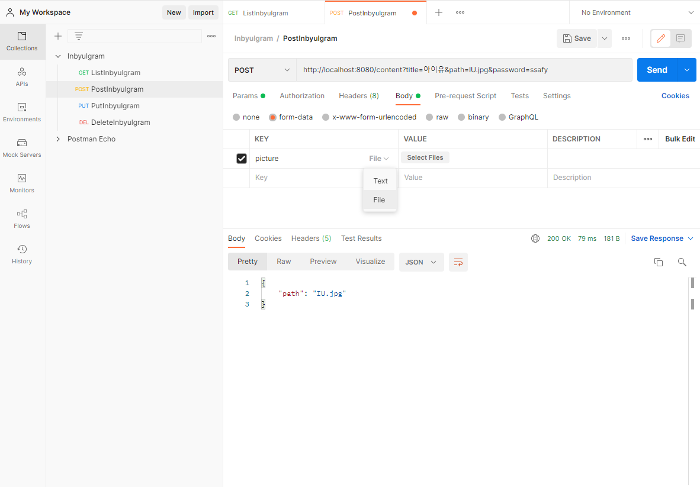
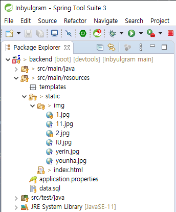
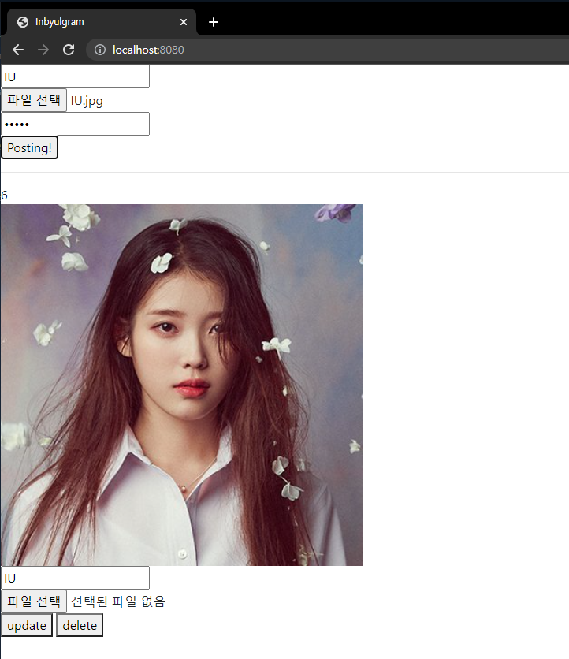

## 선택10. Spring Boot로 인별그램 만들기

> 작업환경 : Spring Boot, Vue.js, h2 DB

목표
1. Spring Boot로 Restful API 서버를 구축하고, CRUD를 완성한다.
2. 파일 업로드/다운로드 기능을 완성한다.

### 1. 스프링 프로젝트 시작  


   * Java Version : 최근 안정적이라고 하는 java se 11로 설정
   * Build Type : Maven과 비교해서 빌드속도가 좀 더 빠른 Gradle로 설정 
 
### 2. 스프링 프로젝트 종속성 설정  


   * Spring boot Devtools : 소스에 변화가 있을 때 수동으로 재시작하지 않아도 서버에 자동 반영
   * Lombok : Get, Set, 생성자 함수를 어노테이션으로 생성 가능
   * Spring Data JPA : SQL 작성없이 객체를 직접 데이터베이스에 저장할 수 있게 도와주는 기술
   * H2 Database : 램(RAM) 메모리에 의존하는 데이터베이스 웹서버. 서버 재부팅 시 기존 데이터가 삭제됨.
   * Spring Web : Spring MVC 기반 웹 프로젝트를 셋팅

### 3. H2 Database 초기 테이블 생성, 초기 데이터 설정
```
spring.jpa.hibernate.ddl-auto=create
```
```java
@Entity
@NoArgsConstructor
@Getter
@Setter
@ToString
public class Content {
	@Id
	@GeneratedValue(strategy = GenerationType.IDENTITY)
	private int uid;
	private String path;
	private String title;
	private String password;
}
```
   * application.properties 파일에서 위 내용 설정 시 서버 시작 시 JPA에서 Entity 어노테이션을 추가한 클래스에 대해 DB에서 테이블을 자동으로 생성


```sql
INSERT INTO content(title, path, password) VALUES ('야경1', 'http://localhost:8080/img/1.jpg', 'ssafy');
INSERT INTO content(title, path, password) VALUES ('야경2', 'http://localhost:8080/img/2.jpg', 'ssafy');
```
  * 서버 시작 시 초기 데이터가 DB에 삽입될 수 있도록 src/main/resousrces/data.sql 파일을 생성

### 4. H2 Database 대시보드 접속


   * 서버 구동 후 http://localhost:8080/h2-console 으로 접속
   * (3.) 에서 추가한 데이터가 정상적으로 들어가 있는지 확인 

### 5. Postman을 사용하여 기능 테스트

  
   * 파라미터 전송 시 Params 탭에서 KEY, VALUE에 값을 넣어서 CRUD 기능 테스트



   * 파일업로드 시 Body 탭에서 form-data 선택한 다음에 원하는 파일을 선택하여 전송. POST, PUT 기능 테스트



  * POST 기능 테스트 후에 서버의 src/main/resource 폴더에 이미지 추가되는 지 확인


### 6. View 화면 만들어서 확인



   * vue.js 이용하여 프론트엔드 구현
   * 서버와 연동하여 게시물 확인, 포스팅, 수정, 삭제가 가능한 웹페이지 작성
